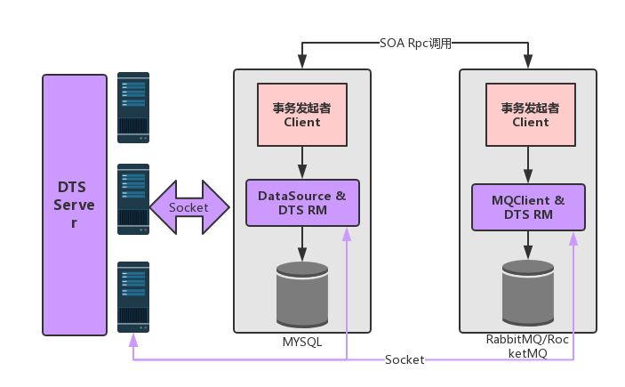
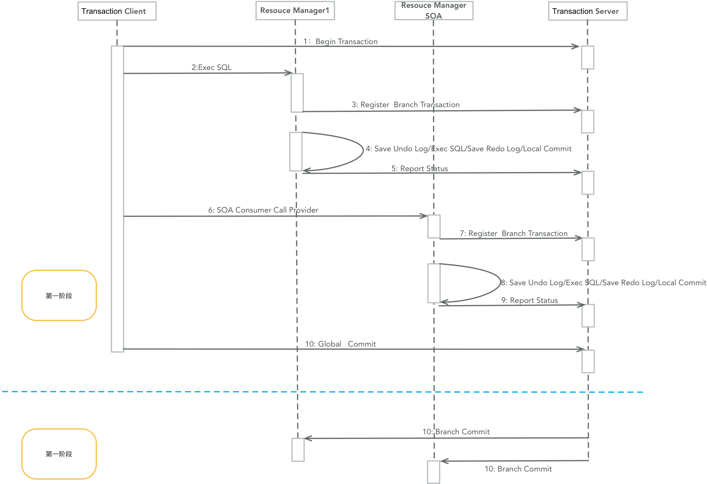

# 概述

  Dts是一款高性能、高可靠、接入简单的分布式事务中间件,用于解决分布式环境下的事务一致性问题;<br/>
  在单机数据库下很容易维持事务的 ACID特性，但在分布式系统中并不容易，DTS可以保证分布式系统中的分布式事务的 ACID 特性

# 功能
* 跨消息和数据库的分布式事务 <br/>
  在某些业务场景中，需要进行多个 DB 操作的同时，还会调用消息系统，DB 操作成功、消息发送失败或者反过来都会造成业务的不完整
* 跨服务的分布式事务 <br/>
  业务完成服务化后，资源与客户端调用解耦，同时又要保证多个服务调用间资源的变化保持强一致，否则会造成业务数据的不完整,DTS支持跨服务的事务
  
# 详细说明

* Dts Server：事务协调器。负责分布式事务的推进，管理事务生命周期
* Dts Client：事务发起者。通过事务协调器，开启、提交、回滚分布式事务
* Dts Resource：资源，包括数据库、MQ

# 架构方案
  * 架构图，如下所示
  
  * 流程图
  

# Compile
```
   mvn install -Dmaven.test.skip=true
```
# 关于Sample
  详细请查看 <a href="https://github.com/linking12/dts/tree/master/dts-example">sample</a>
  
# Quick Start
* 客户端及资源端添加pom依赖

```
<dependency>
	<groupId>io.dts</groupId>
	<artifactId>dts-saluki-support</artifactId>
	<version>${dts.version}</version>
</dependency>
```

* 在Dts客户端、Dts资源端、Dts服务端的启动参数加上-DZK_CONNECTION=127.0.0.1:2181，zookeeper的连接地址，Dts使用zookeeper来做集群管理

* 客户端，在服务调用不同的接口添加@DtsTransaction注解，将两个服务调用纳入整个分布式事务管理


```
 @DtsTransaction
  public HelloReply callService() {
    HelloRequest request = new HelloRequest();
    request.setName("liushiming");
    HelloReply reply = helloService.dtsNormal(request);
    helloService.dtsException(request);
    return reply;
  }

```
* 资源端，针对数据库资源，使用Dts的适配DtsDataSource来使数据库连接池转变为Dts资源

1. 执行script/resource.sql脚本 
2. 将数据库连接池适配为Dts资源端 ,如下示例：

```
  @Bean
  @Primary
  public DataSource dataSource() {
    DruidDataSource datasource = new DruidDataSource();
    int startIndex = dbUrl.lastIndexOf("/");
    String databaseName = dbUrl.substring(startIndex + 1, dbUrl.length());
    datasource.setConnectionProperties(connectionProperties);
    return new DtsDataSource(datasource, databaseName);
  }

```

* 服务端，针对spring boot直接启动Main，将事务协调器启动起来

1. 执行script/server.sql脚本
2. 启动事务协调器服务端


# Q&A

1.请问下dts是两阶段补偿性型吗，是否每个资源锁定都要支持预留和回滚，和tcc-transaction这种类似吗？
>不做资源锁定,不做资源锁定那比如A服务已commit，B服务通信失败的情况怎么处理?这种情况是通过告警，让开发人员介入,因为锁定的话影响的是系统吞吐量.

2.不预留资源也不锁定资源，那阶段一的意义何在呢?
>一阶段已经是真正提交，比起jta的锁定有区别，一阶段的意义在于真正提交的过程中生成undo、redo的日志,二阶段在于拿到undo log来进行rollback。dts不解决脏读的问题，在dts来看，在很短的时间内发生脏读是可接受的。只要保证数据的一致，有点数据冗余无所谓。如果一阶段加锁的话就可以jta/xa了，性能上是无法接受的，而且mysql的xa是不记录prepare日志的。

3.如果一阶段就已经提交，那资源要是不支持的回滚的就只能手工处理了？
>是的，如果是存在数据冲突，dts不处理，只会记录告警内容，发出告警,但是自己可以写个辅助程序专门处理冲突的数据。dts关注的是易用性及最终一致

4.如果一旦有冲突的情况
>数据冲突，要么人工处理，要么幂等，人工处理太麻烦。还是幂等解决质量和效率高点。数据冲突的可能性dts认为是比较小的。

-------

>分布式事务的整个周期很短，毫秒级的，在这么短的时间内，恰好数据被别人修改了，而且事务恰好需要回滚，这是很难撞上的。假设万分之一的事务需要回滚，万分之一的事务在毫秒级时间窗口修改了同一行数据，那么碰到这种告警状态的概率是亿分之一，如果真不走运  碰到了这种情况  告警发出来   开发人员根据告警内容去他的数据库里面找到整个的数据库执行的前后镜像（文本形式） 进而解决冲突  也是分分钟的事情。

-------
>dts不要求幂等  幂等也是增加了开发人员的复杂难度  而且并不是所有的接口都可以保持幂等  所以做crud前  都会记录前后镜像，配合告警是能够定位问题及解决问题dts关注的是易用性的问题，让开发人员更加关注于业务是dts的目标.

5.设计理念清晰，就是叫做dts有点让人望文生义。我倒是对阿里云的gts比较感兴趣，不知具体怎么做到的?
>是和阿里云的dts冲突么？其实我觉得阿里云的dts的名字起的怪啊  dts是Distributed Transaction Service的缩写，分布式事务服务。阿里云的gts的做法和dts是类似的  不过他打通了所有的中间件   另外他支持tcc模式以及还有一种不断retry的模式.dts是想提供一个解决方案方向和基础的baseline

-------
>阿里云的gts和dts的区别在于支持了tcc和retry，另外支持了tddl分库分表组件，事务日志是基于服务端文件系统保存，目前dts的话  仅有一种模式，且事务日志依赖于数据库来保存


